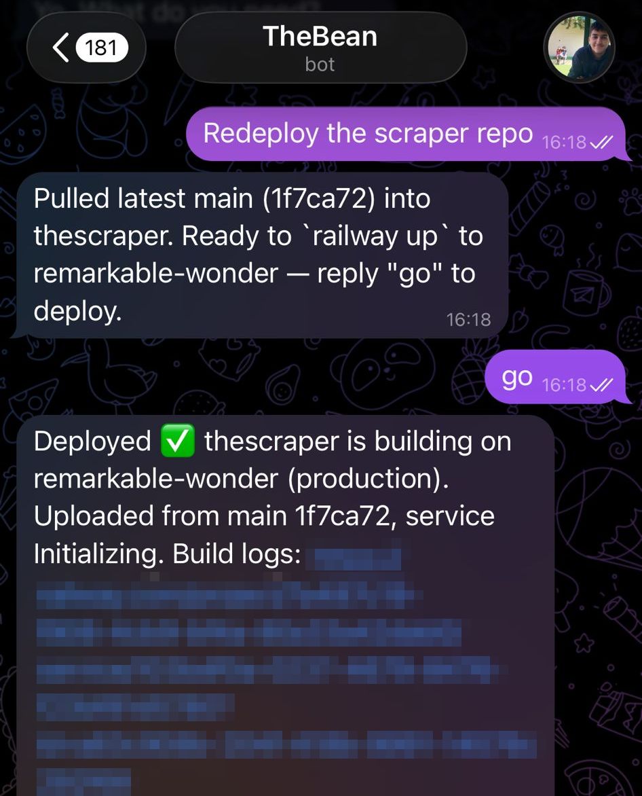

# agent-os

Text your server. It does the work. It asks before spending your money.

This is the scaffolding that turns Claude Code on a $6/mo VPS into a personal agent you drive entirely from
your phone: message-in / work-out, across all your repos and your whole machine, running 24/7, with a hard
safety gate on anything that costs money or leaves the building.

It is not a new agent framework. It is the missing operational layer around Claude Code (and any compatible
agent) that makes "just tell it what to do" actually workable for one person:

- **A config-driven approval gate** - anything that spends money, sends something outbound, deploys to prod, or
  destroys data is BLOCKED until you approve it from your phone ("approve a3f2" in the same chat). Everything
  else (read, draft, build, test, commit) runs free. Fails closed. Approval comes only from your direct
  message, never from anything the agent read (web pages, files, emails), which closes the obvious
  prompt-injection hole.
  (`hooks/costed-action-guard.mjs`, `config/guard.rules.json`)
- **Phone-driven.** A Telegram bridge to a running Claude Code session on an always-on box. You message it, it
  executes with full tool access (shell, git, gh, deploy CLIs) and replies in the same chat.
  (`docs/setup-telegram.md`)
- **Survives reboots and crashes.** A systemd service plus a watchdog timer bring the agent back on its own,
  trust prompts auto-answered. Verified by pulling the plug. (`systemd/`, `bin/start-agent.sh`)
- **Optional brain/hands model split**, so a top-tier model does judgment and code edits while a cheap one
  handles high-volume reads and drafts. (`config/routing.json`, `docs/model-tiers.md`)

One repo, one idempotent installer, one bootstrap script for a fresh VPS.

The design principle: **autonomous on read/draft/build, gated on spend/send/deploy/destroy.** Enforced in
code, not left to the model's judgment.

## What it looks like

A real exchange (a production deploy, gated until the owner says go):



Non-gated work (fix a bug, push a branch, open a PR, dig through logs) runs the same way, minus the
approval step: you describe the problem, it reports back when it's done.

## Quickstart

On your laptop (try the guard with zero commitment):

```bash
node test/guard.test.mjs      # 1. see what the guard would gate (no changes made)
node install.mjs --dry-run    # 2. preview wiring it into your Claude Code settings (writes nothing)
node install.mjs              # 3. wire it in (backs up settings.json first, merges with existing hooks)

node bin/approve.mjs <id>     # approve a gated action by id
node bin/audit.mjs            # see recent gated activity
```

For the full phone-driven setup on an always-on box:

1. `docs/setup-host.md` - provision a small VPS (Hetzner ~$6/mo, or Oracle free tier: `docs/setup-oracle.md`);
   `scripts/bootstrap-host.sh` does node/bun/gh/Claude Code in one shot.
2. `docs/setup-telegram.md` - the Telegram bridge (~5 min, uses your Claude login, no API key).
3. `systemd/` - auto-start + watchdog so it survives reboots and crashes.
4. Copy `examples/home-CLAUDE.example.md` to `~/CLAUDE.md` on the box and fill in your placeholders - this is
   the operator prompt that makes the agent decisive-but-gated.
5. Optional: `docs/setup-routing.md` - cheap-hands model routing.

## Layout

```
hooks/      costed-action-guard.mjs   the PreToolUse approval gate (config-driven, self-locating, fails closed)
config/     guard.rules.json (policy), routing.json (model policy), ccr-config.json (router config)
rulepacks/  general.json (any project) + socialgravity.json (a real-world example pack); add your own
bin/        approve.mjs, audit.mjs, start-agent.sh
systemd/    claude-agent.service + watchdog service/timer
scripts/    bootstrap-host.sh (fresh VPS -> running agent)
skills/     dispatch/  the phone-message -> action routing discipline (a Claude Code skill)
examples/   home-CLAUDE.example.md  the operator prompt template for the box
docs/       setup-host.md, setup-oracle.md, setup-telegram.md, setup-routing.md, model-tiers.md
test/       guard.test.mjs
install.mjs  idempotent installer (backs up settings.json, merges with existing hooks)
```

## Adapting to your stack

Copy `rulepacks/socialgravity.json` (a real pack from a real startup) to `rulepacks/<yourproject>.json`, put
your own costed/outbound command patterns in it, and add the pack name to `enabledPacks` in
`config/guard.rules.json`. Nothing else changes.

## Safety notes

- The gate is only as good as its patterns. It fails closed and errs toward gating, but review `rulepacks/*`
  against your stack. Add anything that spends or destroys.
- The hook only ever rules on actions it gates. Everything else passes through untouched to Claude Code's
  normal permission flow; the guard never auto-approves on your behalf.
- Never route personal/identity data to a cheap HOSTED model. See the privacy line in `config/routing.json`.
- Installing makes the gate live for every session using that `settings.json`, including parallel agents.
  Prefer the dedicated host.
- The Telegram allowlist is the auth boundary: only your paired chat id can drive the agent. Keep it that way.

See `ARCHITECTURE.md` for the why behind each piece.

## License

MIT
